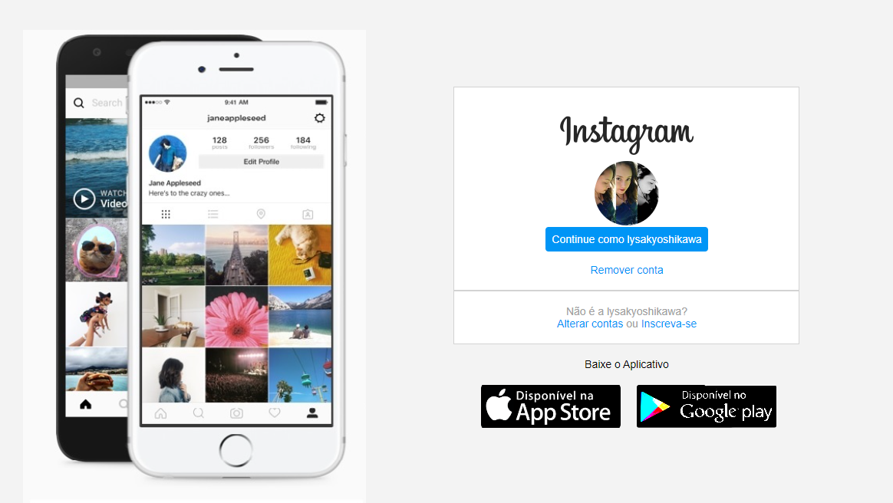

# :octocat: Pagiga de Login Instagran 

  #  :rocket: Sobre o Projeto

Objetivo do projeto é abordar os conceitos sobre css flexbox e responsividade, atraves do layout da página de login do instagram.

# :pushpin: Tecnologias Ultilizadas

- HTML /CSS

# :pushpin: Como executar o projeto

  - Clone o repositoy 
  $ git clone <https://github.com/LysaKYoshikawa/pageinstagran>
  
  - Editor de texto
  é desejavel que tenha um editor de texto como VSC
  
  - Abrir o documento
  Abra o editor de texto dentro da pasta onde salvou o clone do projeto
  
  - documento de extensão html
  Abra o documento de index.html em uma pagina html 

# :pushpin: Author
Monalysa Klauck Yoshikawa
[Linkedin] : <https://www.linkedin.com/in/monalysa-yoshikawa/>
